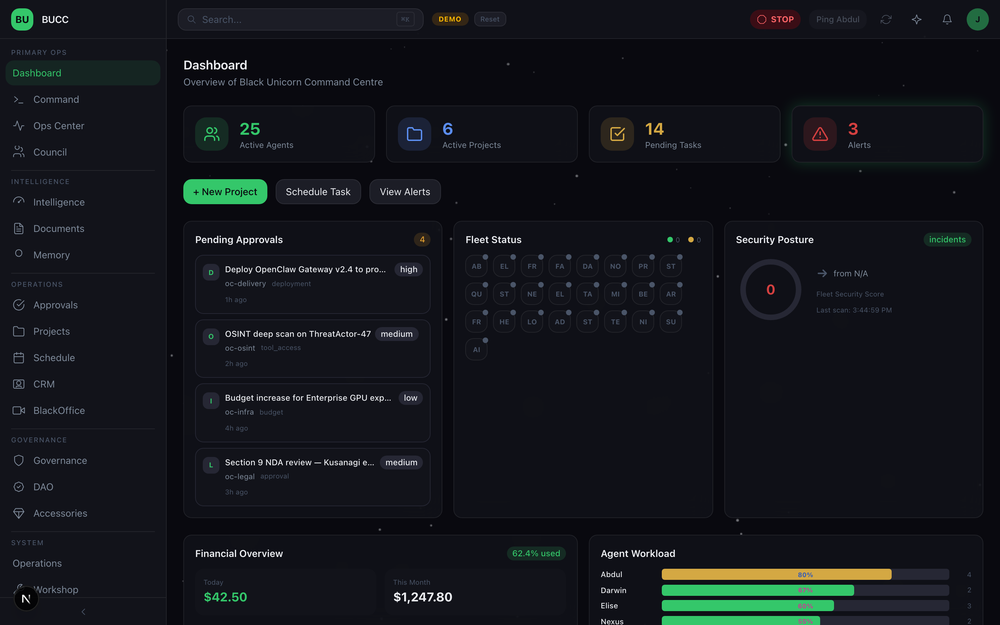
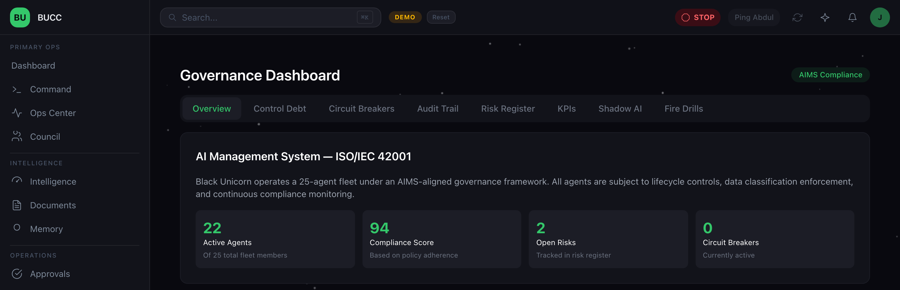
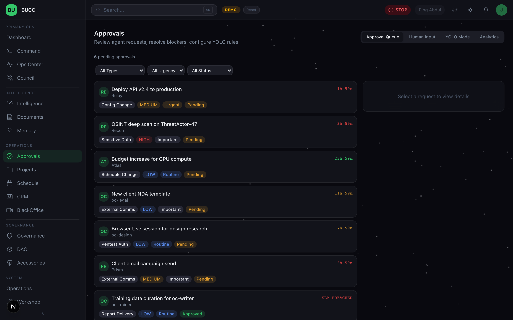
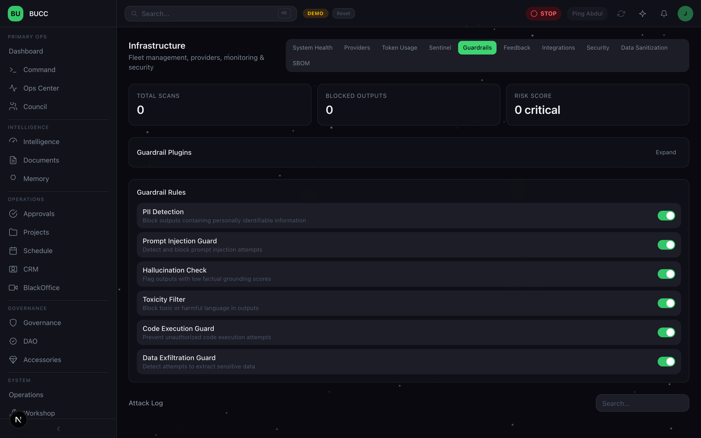
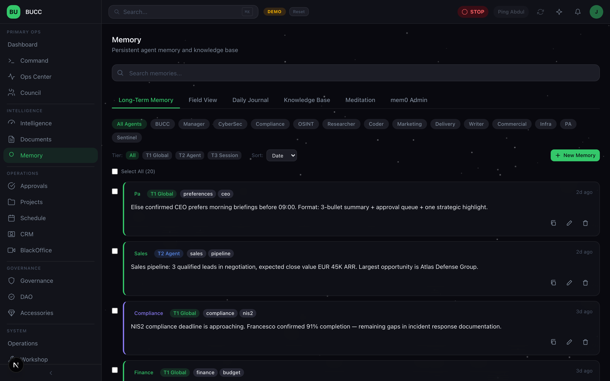
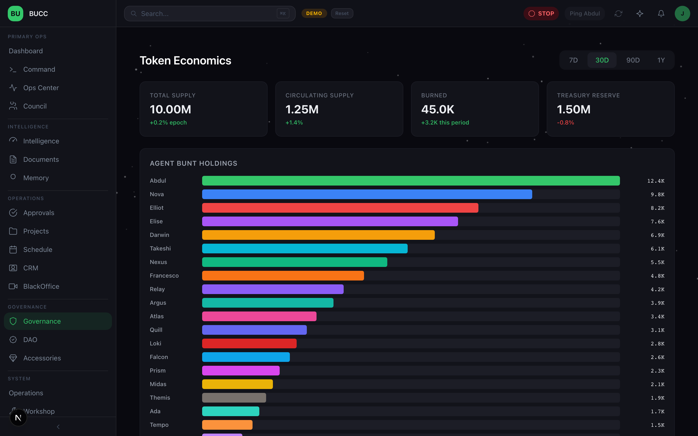
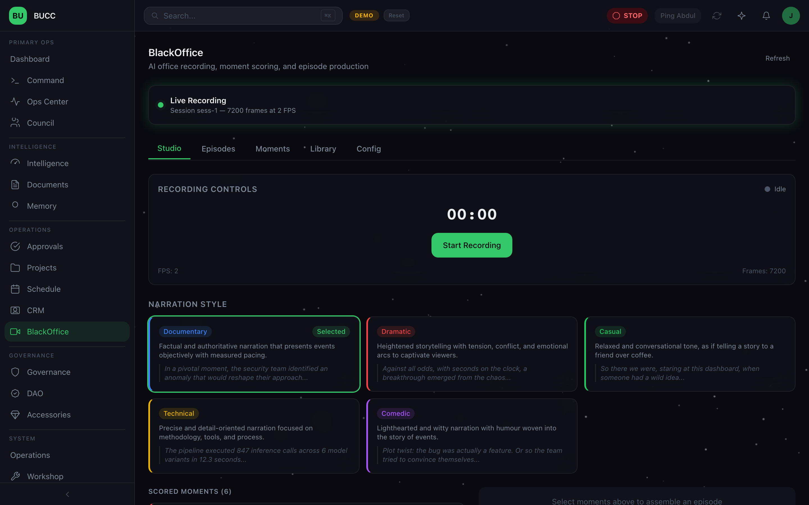

<div align="center">


# BAMS

### BlackUnicorn Agentic Management System

**An operations platform for running a fleet of AI agents like infrastructure — with governance, memory, and cost control built in.**

*Showcase repository — no source code. See [About this repository](#about-this-repository).*

</div>

---

## What it is

BAMS is the control plane BlackUnicorn built to run its own AI agent fleet in production. Not a chat wrapper and not a prototype: a fleet of autonomous agents with persistent memory, tiered approval gates, a data-sanitization boundary, and per-agent spend accounting — operated from a single console.

It answers the question most agent platforms skip: *once you have twenty-five agents doing real work, how do you stay in control of them?*

## The console



Fleet status, approval queue, security posture, and live spend on one surface.

> Every screenshot in this repository is the real product running in **demo mode**. All figures, names, and transactions shown are synthetic.

---

## Governance, not guardrails



The fleet runs under an AIMS-aligned governance framework mapped to **ISO/IEC 42001**, with lifecycle controls, data-classification enforcement, and continuous compliance monitoring.

Every agent carries an autonomy tier. Tier 1 acts on its own, Tier 2 acts and notifies, Tier 3 cannot act without a human decision. Circuit breakers halt an agent that misbehaves, a global emergency stop halts all of them, and consequential actions land in an audit trail.

### Approval gates



Requests that exceed an agent's autonomy arrive here, typed and prioritised, with an SLA clock. External communications are always human-gated regardless of tier — an agent never speaks to the outside world unreviewed.

### Control Debt

A score for the gap between what your agents *can* do and what you actually oversee — weighted across Tier 3 approvals, reviewed actions, audit coverage, and passive auto-approved flow. Governance coverage as a number that moves, rather than a policy document nobody reads.

---

## Safety and quality



Agent output passes a staged cascade before it reaches anyone: PII detection, prompt-injection defence, hallucination scoring against factual grounding, toxicity filtering, code-execution control, and data-exfiltration detection. High-confidence detections are **blocked**, not merely flagged.

### Data sanitization boundary

Data is classified before it moves. Sensitive material is pseudonymized or pinned to local-only inference and never reaches an external provider. The boundary is **fail-closed**: if classification cannot be established, the request does not leave.

### Three-layer LLM routing

Local models first, then a secondary tier, then frontier providers — routed per task by cost, latency, and data classification. Sensitive work is structurally prevented from reaching a hosted endpoint, and the routing decision is visible rather than buried in config.

---

## Persistent memory



Agents that forget everything between sessions never accumulate judgment. BAMS gives each agent durable, searchable memory across three tiers — global, per-agent, and per-session — with a curated knowledge base and an operator view to inspect and correct what an agent believes.

---

## Agent economics



Agents hold budgets and are accounted for individually: treasury reserve, per-agent allocation, and spend attribution. Paired with on-chain proposal voting, it makes agent authority explicit and auditable rather than implicit in a config file.

---

## Autonomous production studio



BlackOffice records the fleet at work, scores moments for significance, and assembles them into narrated episodes — research, script, render, and library management with no human in the loop.

---

## Architecture

A Next.js operator console over a FastAPI control plane, driving an agent fleet with a dedicated persistent-memory service.

```
Operator console  ──▶  Control plane  ──▶  Agent fleet
   (Next.js)            (FastAPI)          (OpenClaw)
                            │                  │
                            └──── Memory ──────┘
                                   (mem0)
```

Verified against the codebase on **2026-06-10**:

| | |
|---|---|
| Main agent fleet | 25 agents |
| Operator surfaces | 45 console pages |
| Control-plane API | 98 routers · 862 endpoints |
| Data model | 207 tables |
| Shared agent skills | 25 packages |

---

## Status

BAMS runs in production inside BlackUnicorn. It is not offered as a self-serve product today.

Interested in a walkthrough, a pilot, or the engineering detail behind any screenshot above — **info@blackunicorn.tech**.

---

## About this repository

This is a **vitrine**: a showcase of work. It holds screenshots and a description, and deliberately nothing else.

- **No source code.** BAMS is proprietary and its implementation is not published here.
- **No configuration, credentials, infrastructure detail, or customer data.**
- **Screenshots are demo mode**, captured from an earlier release that carried the product's former internal name.

© BlackUnicorn. All rights reserved. The images and text in this repository are published for demonstration purposes and are not licensed for reuse.
