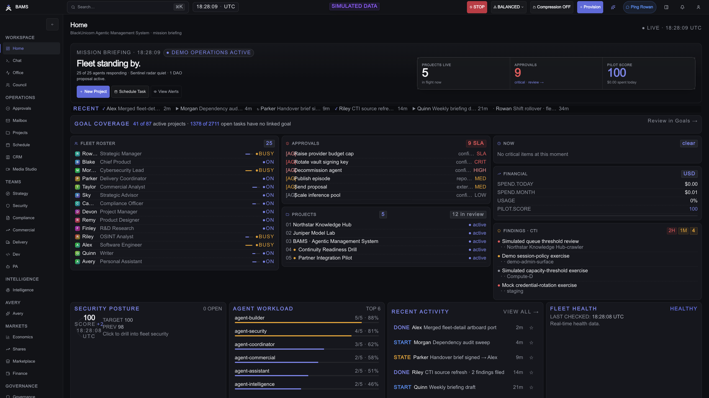
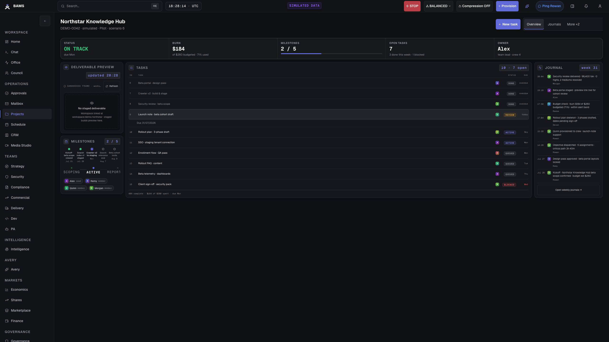
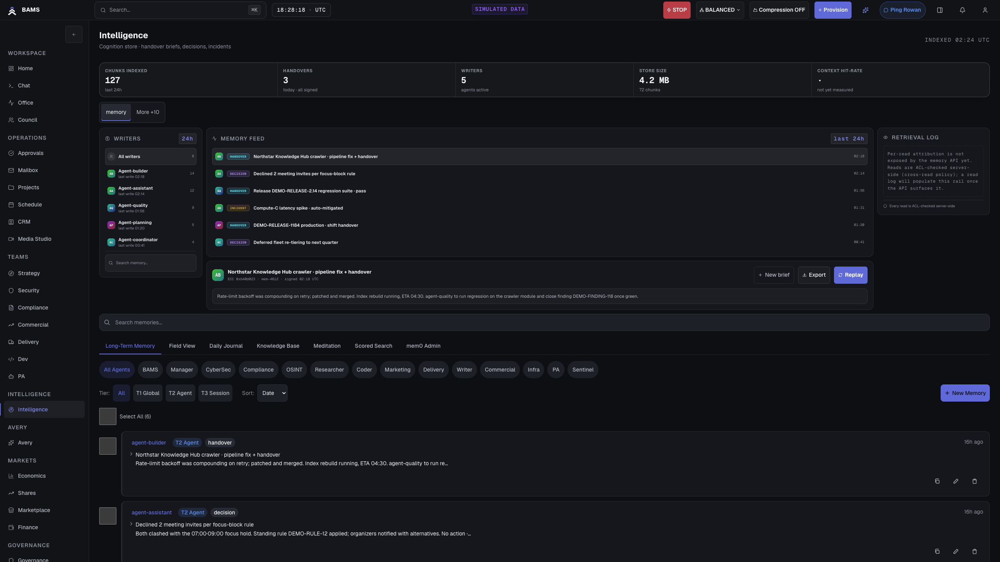
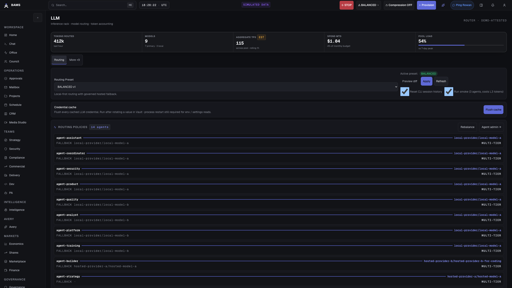
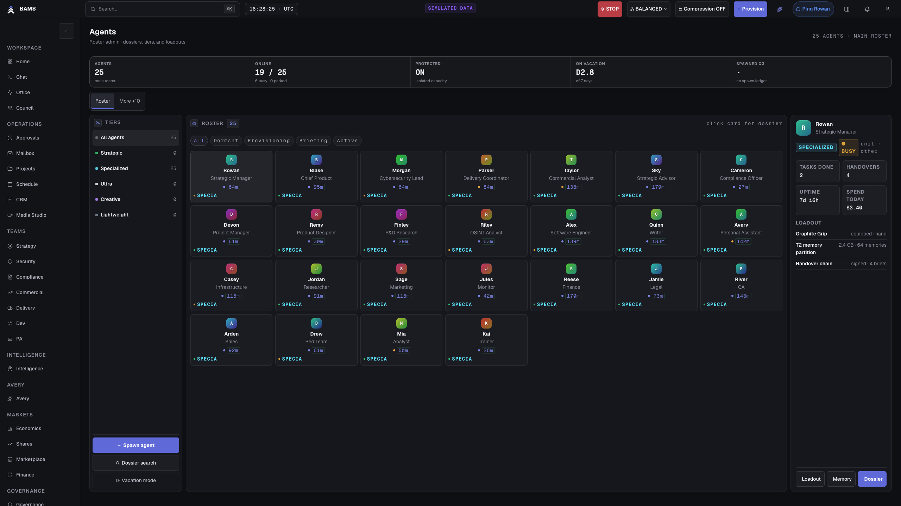
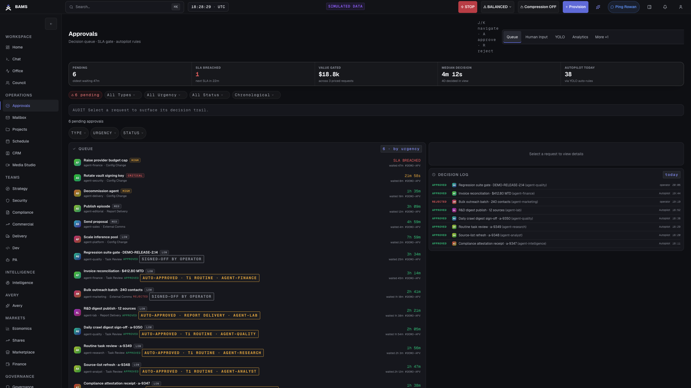
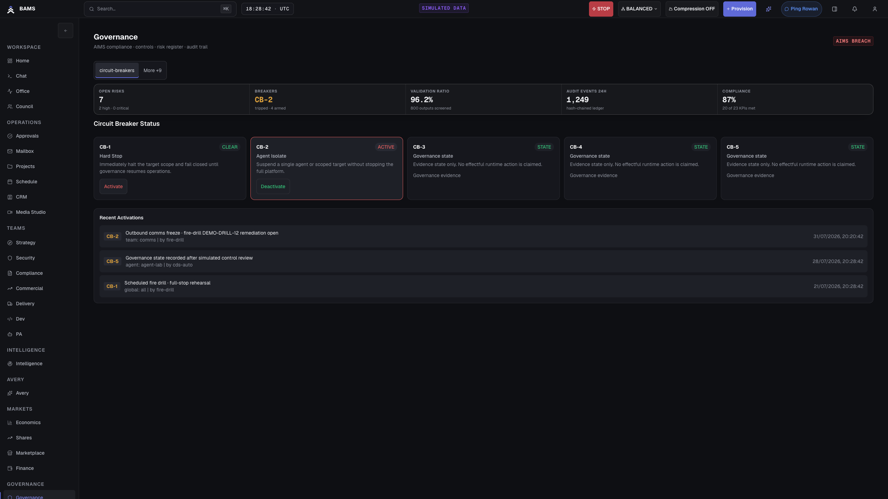
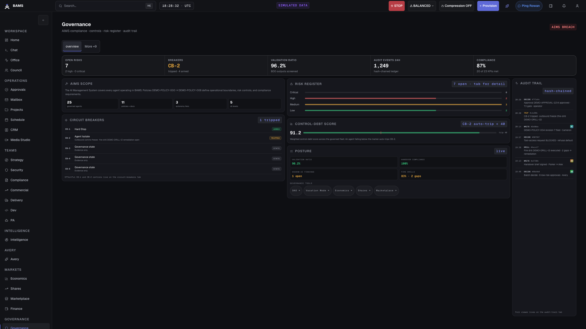
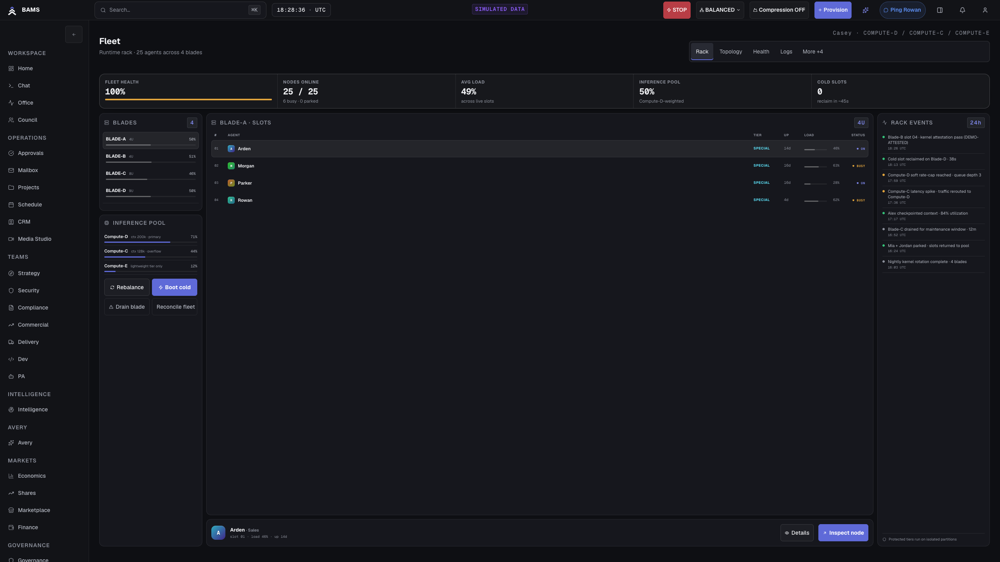
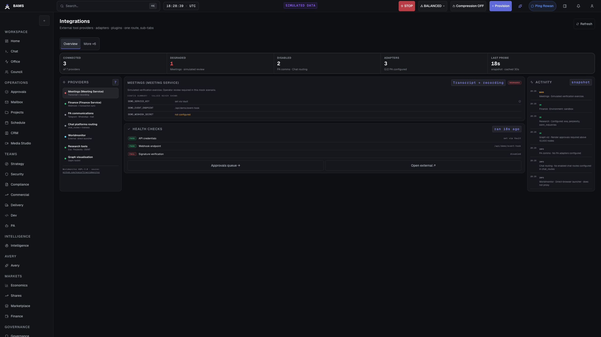

<div align="center">


# BAMS

### BlackUnicorn Agentic Management System

**Governed enterprise AI, deployed with no strings attached.**

BAMS is the operating system BlackUnicorn built to run AI agents as governed infrastructure. It connects work, agent identities, organizational knowledge, model routing, approvals, security controls, audit evidence, and infrastructure operations in one control plane.

You control the infrastructure. You control the model layer. You decide where
knowledge is retained and which approved context may reach a configured
provider. Human authority remains explicit.

*This is a public showcase repository. It contains product evidence, not source code.*

</div>

---

## A model is not an operating system

A capable model can generate an answer. An enterprise AI system also needs to know:

- which agent is acting;
- what that agent may access;
- which model may receive the request;
- which organizational knowledge applies;
- when a human decision is required;
- how work moves from intent to evidence;
- how to stop a failing agent or provider;
- what happened, who approved it, and what it cost.

BAMS puts those decisions in the control plane. It is not a chat wrapper and it is not a collection of disconnected agents.

## One operating surface



The operator sees current work, decision queues, fleet health, risk signals, and infrastructure state without reconstructing the story from model logs and vendor consoles.

> Every screenshot in this repository is the current BAMS interface running through a dedicated public-safe demo projection. It removes protected tiers and replaces internal identities, projects, hosts, models, routes, incidents, and integration details with deterministic fictional data. Each capture is 2560 by 1440 pixels and carries a visible **SIMULATED DATA** label.

## What BAMS controls

| Control plane | What it gives the organization |
|---|---|
| Governed work | Goals, projects, milestones, hierarchical tasks, RACI, weekly journals, approvals, activity history, and evidence |
| Agent identity | Named agents with lifecycle state, skills, permissions, schedules, routing policy, memory scope, telemetry, and incident history |
| Human authority | Tiered autonomy, typed approval queues, decision routing, review states, operator intervention, and auditable outcomes |
| Organizational knowledge | Durable memory, document and knowledge surfaces, global, agent, and session scopes, cross-read ACLs, inspection, correction, and unified search |
| Model control | Local and hosted model routes, OpenAI-compatible providers, per-agent chains, live presets, provider health, quotas, OAuth, and Vault-backed credentials |
| Security boundary | Data classification, local-only routing, sanitization, guardrail policies, least-privilege ACLs, domain allowlists, audit, and isolation controls |
| Runtime brakes | Agent pause and lifecycle controls, provider circuit breakers, effectful CB-1 and CB-2 stops, and CB-3 through CB-5 governance state |
| Infrastructure operations | Service health, model capacity, memory services, storage, gateways, metrics, and operational status |
| Integration control | Live-probed integration states, governed browser sessions, communication channels, MCP tools, and connector health |
| Governance evidence | Policy catalog, risk register, KPIs, Control Debt, validation ratio, audit integrity, and review receipts |

## Governed work, from intent to evidence



BAMS gives agent work an organizational shape. Projects carry a charter, ownership, classification, members, milestones, tasks, activity, and journals. Governance rules are enforced in the workflow, including charter-before-active, RACI completeness, weekly journals, review before final completion, and approval for project closure.

In the autonomous work path, an agent reporting completion proposes a review state. It does not silently mark its own work final. The organization keeps the last word.

## Plug in the knowledge the organization already has



BAMS uses persistent memory and governed knowledge instead of rebuilding context in every prompt.

- The reference memory path runs locally with mem0, Qdrant, and Ollama.
- Memory is scoped globally, per agent, and per session.
- Cross-agent reads follow an explicit ACL matrix.
- Operators can inspect, correct, promote, and search retained knowledge. Governed writes and administrative changes create audit evidence. The memory API does not claim complete per-read attribution.
- Documents, project evidence, journals, and search remain inside the operator knowledge surfaces. Connecting approved client sources to model working context is client-specific deployment work performed with the FDE.
- Classification controls decide what may be injected into a route and what must remain local.

This lets an organization connect its operating knowledge without handing the memory layer to a hosted AI vendor.

## Control the model layer



BAMS separates the operating system from the model provider.

- Run local models through Ollama.
- Register OpenAI-compatible local or hosted endpoints.
- Build per-agent provider chains across local, subscription, and pay-per-token layers.
- Change routing presets without rebuilding the platform.
- Inspect provider health, latency, quota, and circuit-breaker state.
- Store provider credentials in Vault.
- Pin protected workflows to local-only inference.

BAMS does not pretend that every model weight is yours. It gives you control over the models and providers you are entitled to run, and it keeps the routing decision visible. Retained knowledge remains in the client-controlled topology. When policy authorizes a hosted route, approved and sanitized request context may reach that configured provider.

## Give every agent an identity and a boundary



An agent in BAMS is not an anonymous API call. It has a declared identity, organizational unit, leader, lifecycle state, skill set, access policy, model route, memory scope, schedule, telemetry, and audit lineage.

The internal reference deployment runs a 25-agent main fleet. BAMS also supports isolated protected tiers for sensitive work. The isolation function is the public product claim. Protected names, missions, personas, hosts, and tier sizes are not exposed in this repository.

Operators can pause, resume, update, restart, or decommission agents through explicit lifecycle controls. Transitions are recorded so the fleet cannot drift invisibly between configuration and runtime.

## Keep human authority in the workflow



BAMS uses three static autonomy tiers. Actions defined by policy can proceed, notify, or create a typed decision for a human or delegated organizational authority. An optional per-decision risk classifier can raise an approval tier, but it is a preview capability and is disabled by default.

The approval system carries the request context, urgency, routing, status, and decision history. Operators can approve, reject, request modification, or delegate where the workflow permits. Communication and high-impact actions can be gated by approval and allowlist policy instead of relying on a prompt to behave.

## Stop the system when policy or runtime health breaks



BAMS exposes stop controls as operating mechanisms, not policy prose.

- CB-1 provides an effectful fleet stop. CB-2 provides effectful agent or team isolation.
- CB-3 through CB-5 record governance states for degraded operation, recovery, and post-incident handling. They are not presented here as effectful runtime controls.
- Per-provider circuit breakers prevent a failing model endpoint from dragging the fleet down.
- Per-agent lifecycle controls isolate a bad actor without losing control of the rest of the system.
- Fire drills exercise the CB-1 and CB-2 lifecycle effects and record state transitions for the remaining governance levels.
- Enforcement state is visible so a warning mode cannot be mistaken for a hard stop.

## Keep the security boundary on the routed path

BAMS includes built-in data sanitization and guardrail controls. It also integrates the named BlackUnicorn security stack:

- **RuneLM** is the Data Sanitization Proxy.
- **BonkLM** is the guardrails and scanner engine.
- **DojoLM** is the red-team, evaluation, and compliance platform.

These controls apply to configured routed inference paths. BAMS does not claim that every execution path receives the complete routed security pipeline. Deployment acceptance verifies the paths and policies selected for the client environment.

## Turn governance into runtime evidence



The governance surface is aligned to an AI management system and mapped to ISO/IEC 42001 operating concerns. It brings together the governed-agent inventory, policy catalog, RACI, data classification, risk register, operational KPIs, and evidence.

BAMS also calculates runtime governance measures:

- a per-agent Control Debt score derived from operational evidence;
- a validation ratio that quantifies human oversight across approval and review paths;
- five-level circuit-breaker state and recovery history;
- an HMAC-chained audit trail with integrity verification;
- optional external anchoring when a deployment configures it.

The aim is not to claim certification from a dashboard. The aim is to make controls inspectable and give assurance work concrete receipts.

## Operate the infrastructure as part of the AI system



Agents depend on model servers, memory, databases, gateways, storage, credentials, and observability. BAMS keeps those dependencies in the operational picture.

The infrastructure surfaces cover deep health, model capacity, memory services, provider status, storage tiers, Vault connectivity, service metrics, and fleet readiness. Operators can see whether an agent failure is a reasoning problem, a policy stop, an exhausted provider, or an unhealthy dependency.

## Make integrations governed and observable



BAMS treats an integration as an operational dependency with a visible state. The board distinguishes connected, degraded, and unconfigured services instead of implying that every connector is ready in every deployment.

The current platform includes governed browser automation, communication channels, meetings, storage, model providers, Mattermost, and an MCP operator server. Connector readiness varies by deployment and is stated on the surface.

The MCP server exposes 18+ governed operator tools across four access tiers. The admin console, MCP transports, and Mattermost command path share the same server-side gate stack.

## Architecture

BAMS uses a Next.js operator console over a FastAPI control plane and PostgreSQL data model. OpenClaw runs the agent fleet. mem0, Qdrant, and Ollama provide the local memory path. Vault protects credentials. Metrics and deep-health probes keep the dependencies observable.

```text
+---------------- CLIENT-CONTROLLED DEPLOYMENT ----------------+
| People and approval authorities                              |
|                   |                                          |
|                   v                                          |
|          BAMS operator console                               |
|                   |                                          |
|                   v                                          |
|           FastAPI control plane                              |
|                   |                                          |
|       +-----------+-----------+-----------+                  |
|       |                       |           |                  |
|       v                       v           v                  |
| Agent fleet              Knowledge    Model routing          |
| and governed work        and memory   and policy             |
|       |                       |           |                  |
|       +-----------------------+-----------+                  |
|                               |                              |
|                               v                              |
|                       Audit and evidence                     |
|                                                              |
| Model routing -- approved and sanitized request context -----|---->
+--------------------------------------------------------------+     Configured
                                                                     hosted provider
```

Current internal reference, verified against the codebase on **2026-07-31**:

| Measure | Current reference |
|---|---:|
| Main agent fleet | 25 |
| Dashboard page files | 48 |
| Non-classified emitted operator routes | 46 |
| API router files | 104 |
| API endpoint decorators | 875 |
| Unique route-decorator paths | 760 |
| Declared data tables | 210 |
| Shared skill packages | 25 |

These numbers describe the proprietary internal reference implementation. They are evidence of product depth, not an API stability promise.

## What no strings attached means

BAMS is designed for operational ownership by the organization deploying it.

- **Your infrastructure:** run the custom installation in an environment your administrators control.
- **Your model choices:** use local or hosted providers according to your rights, policy, cost, and risk requirements.
- **Your knowledge:** keep memory stores, documents, credentials, and evidence inside the topology you approve. Approved and sanitized request context may reach a hosted provider when policy selects that route.
- **Your operating model:** encode existing teams, authority, approval paths, knowledge boundaries, and risk rules instead of adopting ours unchanged.
- **Your handover:** receive deployment configuration, operating runbooks, acceptance evidence, and knowledge transfer for the installed environment.

A forward-deployed engineer is part of a BAMS deployment engagement. The FDE works with your team to map the operating model, connect approved knowledge sources and providers, establish controls, test configured circuit-breaker and operational-recovery acceptance paths, and complete handover against agreed criteria.

The objective is not to make BlackUnicorn a permanent operator of your system. It is to leave your organization able to run the deployment it paid for.

No strings attached does not mean no license. BAMS remains proprietary and commercially licensed. It means there is no required BlackUnicorn cloud, no forced model provider, and no requirement to retain BlackUnicorn for day-to-day operation.

## Availability

BAMS is available now as a custom Enterprise Edition deployment for organizations that want governed enterprise AI inside infrastructure they control.

Each deployment is engineered around the client's security boundary, organizational structure, knowledge sources, model policy, integrations, approval paths, and operating requirements. The BAMS control plane, deployment work, acceptance evidence, operating runbooks, and FDE handover are part of the delivery.

BAMS Enterprise Edition is a private, client-controlled installation, ready for deployment now. It is not a shared self-serve SaaS.

Read more at [blackunicorn.tech](https://blackunicorn.tech) or contact [info@blackunicorn.tech](mailto:info@blackunicorn.tech).

## About this repository

This repository is a vitrine. It contains the public product narrative, an approved BlackUnicorn mark, and current screenshots.

- **No source code.** BAMS is proprietary and its implementation is not published here.
- **No configuration, credentials, internal network addresses, or customer data.**
- **Simulated data only.** The screenshots use the dedicated public-safe demo projection and carry a visible label.
- **Current interface.** The screenshot set was captured from the Graphite BAMS interface on 2026-07-31 at 2560 by 1440 pixels.

© BlackUnicorn. All rights reserved. The images and text in this repository are published for demonstration purposes and are not licensed for reuse.
